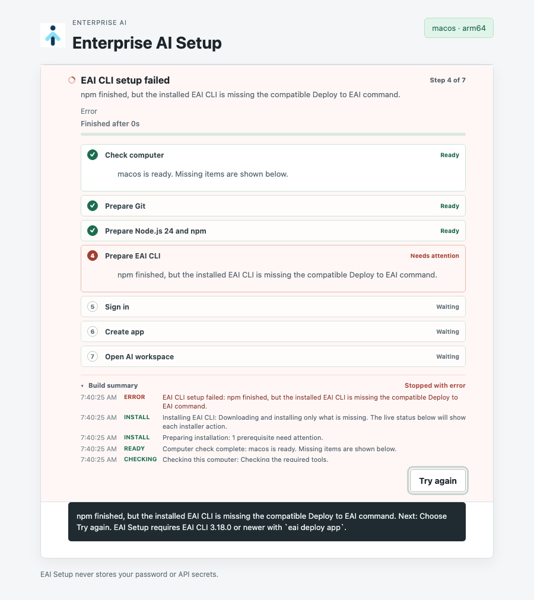
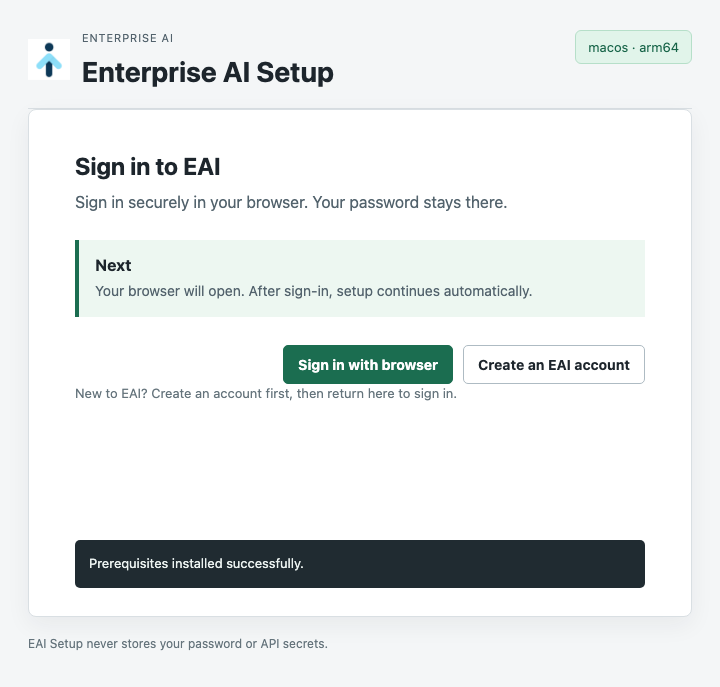

# Installer compatibility recovery

- Preview: <http://127.0.0.1:43183/> while `npm run preview:managed-deploy` is running.
- Browser evidence: `preview/browser-evidence.json`, including precise capture time, Chromium version, source revision and hashes.
- Presented by: Codex browser self-review, 23 September 2026; no stakeholder approval inferred.
- Scope: actual installer UI with controlled Tauri responses. No native installation or real authentication was attempted.

| Change shown | Evidence | Feedback | Next change | Open UX issues |
| --- | --- | --- | --- | --- |
| Exact minimum-version failure and Try again action | Four screenshots at native default/minimum viewport sizes | Agent confirmed text wraps and keyboard focus is visible | Successful retry now reaches sign-in instead of leaving an empty panel | none |

The existing installer layout, logo, colors and copy were preserved. This is an installer surface, so the EAI app-template baseline, Storybook stories, package lanes and theme overrides are not applicable. Browser assertions prove no horizontal overflow, visible recovery, keyboard activation, terminal prerequisite state and absence of page errors. Existing live-region markup is retained.

User feedback is pending: review whether the minimum-version recovery instruction is clear. No additional visual issue remains in the tested scope. Visible native browser presentation could not be completed because the computer-use capture service was unavailable; screenshot presentation and automated Chromium rendering succeeded.
